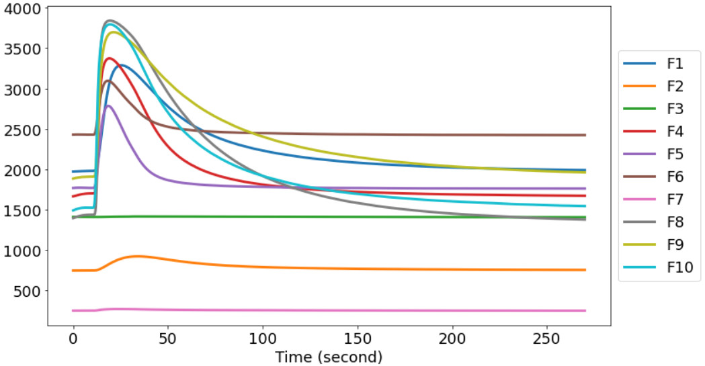
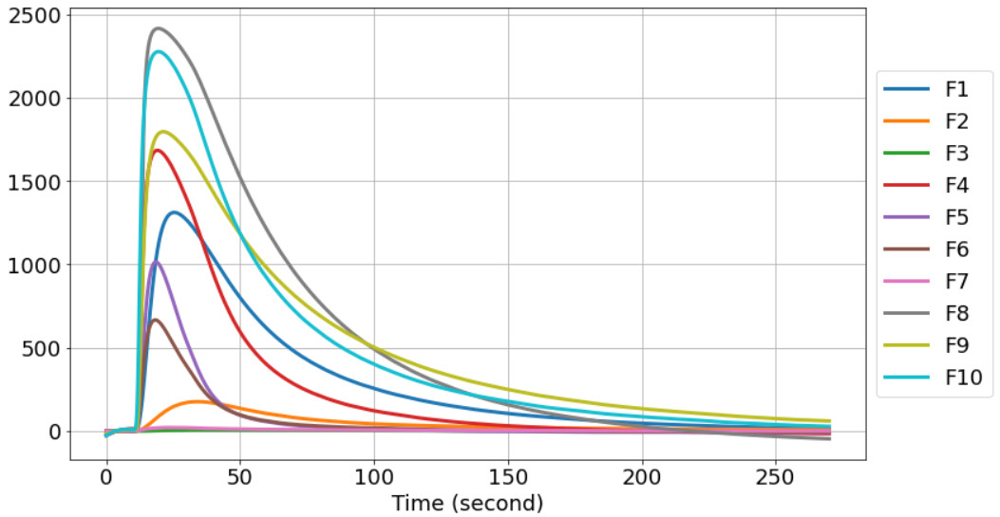

# Vanilla Quality Classification using Electronic Nose (e-nose)

## Overview

This repository contains the code and data for a research project focused on classifying the quality of synthetic vanilla using an electronic nose (e-nose). The electronic nose is equipped with 10 Metal Oxide Semiconductor (MOS) sensors, along with additional humidity and temperature sensors. The goal is to identify the characteristics of synthetic vanilla that pass or fail the organoleptic test through aroma analysis.

## Methodology

### Data Collection

1. **Vanilla Samples:** 210 grams of vanilla powder were divided into two groups: 105 grams passing the organoleptic test and 105 grams failing the test.

2. **E-nose Measurements:** The e-nose, with 10 gas sensors and additional sensors, measured the voltage (mV) over a sampling time. Data was collected with a 10-second delay, 20-second sampling, and 260-second purging, resulting in a total sampling time of 290 seconds.

3. **Data Storage:** Measurement data was stored in CSV format using Genose Data Logger with 35 data points collected for every 3 grams of vanilla powder, resulting in a total of 70 data points for each label (pass/fail).

### Data Preprocessing

1. **Baseline Calibration:** Due to variations in sensor readings at the start, a baseline calibration was performed by subtracting the average of the first 10 seconds from the readings of each sensor.

| Uncalibrated           | Calibrated              |
| ---------------------- | ---------------------- |
|   |  |

2. **Feature Extraction:** Three window feature extraction methods were employed:
   - Without window
   - 2-window extraction
   - 3-window extraction

   Each window utilized maximum, gradient, median, and average values.

### Classification

Support Vector Machine (SVM) was chosen as the classifier with two kernels: Linear and Radial Basis Function (RBF). Grid search fine-tuning was employed to optimize hyperparameters (C and gamma) using Leave One Out Cross Validation (LOOCV). Data standardization was performed before training, and a 4:1 ratio was used for splitting training and testing data.

## Results

The research demonstrates that SVM with the Radial Basis Function (RBF) kernel outperforms the Linear kernel, especially with two and three window feature extractions, achieving an accuracy range of 96.4% to 100% on the training data.

## Repository Structure

- **/data_raw:** Contains the raw data in CSV format.
- **/data_baseline:** Contains the preprocessed data in CSV format.
- **/data_baseline:** Contains extracted data using each feature extraction method in CSV format.
- **/code:** Includes the Python code for data understanding, data preprocessing, feature extraction, and SVM classification.
- **/Exp:** Holds experimental results include binary data and visualization.
- **/model:** Contains trained SVM model.

## License

This project is licensed under the MIT License - see the [LICENSE.md](LICENSE.md) file for details.